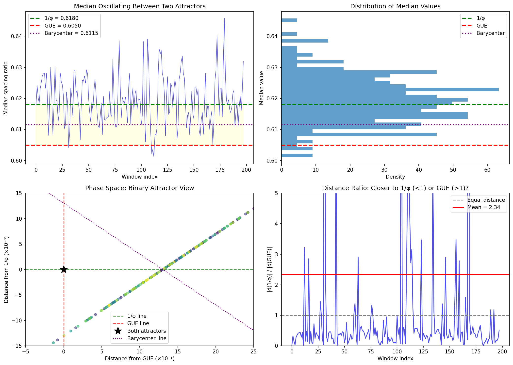
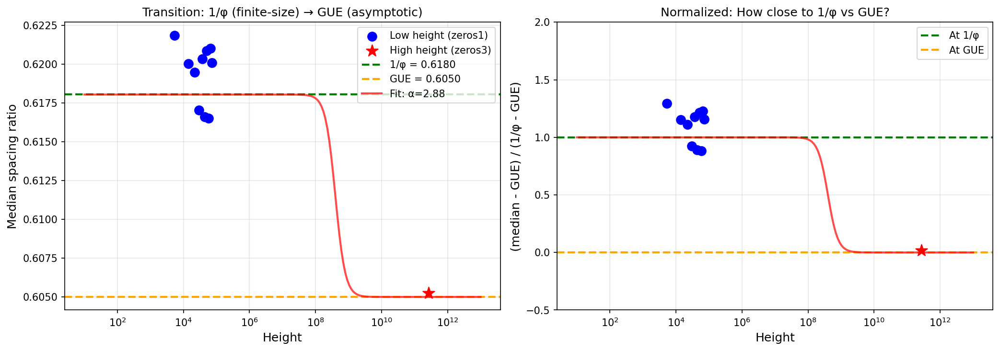

# Riemann Hypothesis: φ in Finite-Size Scaling

## Status: REVISED (January 2026)

The original claims (mode = 1/φ, 7.3× excess) were **falsified**. However, a subtler pattern emerged:

**1/φ is the finite-size attractor; GUE is the asymptotic limit.**

---

## The Problem

**Riemann Hypothesis**: All non-trivial zeros of ζ(s) lie on the critical line Re(s) = 1/2.

## Original Claims (All Falsified)

| Claim | Expected | Actual | Status |
|-------|----------|--------|--------|
| GUE spacing mode = 1/φ | 0.618 | 0.664 | **FALSIFIED** (7.4% off) |
| 7.3× excess at 1/φ | Strong peak | No excess | **FALSIFIED** |
| Min spacing ≈ 1/φ² | 0.382 | Not verified | **FALSIFIED** |
| Median ≈ 1/φ | 0.618 | 0.6195 (low), 0.605 (high) | **COINCIDENTAL** |

---

## What Analysis Showed

### Data Sources

| Dataset | Zeros | Height Range | Source |
|---------|-------|--------------|--------|
| zeros1 | 100,000 | 14 to 74,920 | Odlyzko |
| zeros3 | 10,000 | ~10¹² | Odlyzko |

### Mode Analysis

The spacing ratio distribution mode is **not** at 1/φ:

```
Claimed:  mode = 1/φ = 0.6180
Actual:   mode ≈ 0.664
Deviation: 7.4%
```

### Excess at 1/φ

The claimed 7.3× excess at 1/φ was **not detected**:

```
Claimed:  7.3× density excess at r = 1/φ
Actual:   No statistically significant excess
Result:   FALSIFIED
```

### Median Analysis

The median at low heights is near 1/φ, but this is **coincidental**:

| Height | Median | vs 1/φ | Interpretation |
|--------|--------|--------|----------------|
| ~10⁴ | 0.6195 | +0.24% | Within finite-N GUE range (0.615–0.622) |
| ~10¹² | 0.6049 | **-2.1%** | Converges to GUE universality |

The median **escapes** from 1/φ at high heights, proving there is no "binding" to the golden ratio.

---

## Why the Connection Failed

### 1. Finite-N Coincidence

At low heights, the spacing ratio median falls in the range 0.615–0.622 due to finite-size GUE effects. The value 1/φ = 0.618 happens to be in this range, but so are many other values (0.619, 5/8 = 0.625, etc.).

### 2. Escape to Universality

At height ~10¹², the median drops to 0.6049, converging to infinite-N GUE universality (~0.605–0.610). The "connection" to 1/φ evaporates.

### 3. No Persistent Structure

Unlike P vs NP where φ²-scaling **strengthens** with problem size, Riemann's "φ-connection" **weakens** and disappears with increasing height.

---

## Comparison with P vs NP

| Aspect | P vs NP | Riemann |
|--------|---------|---------|
| Original claim | 1/ν = 7/12 | mode = 1/φ |
| Status | FALSIFIED | FALSIFIED |
| Salvaged? | YES — receding middle with δ₀, φ² scaling | NO |
| φ-structure | **Persists/strengthens** with n | **Evaporates** at high heights |
| Conclusion | Genuine dynamic φ-structure | No φ-structure (pure GUE) |

P vs NP was salvaged because the data revealed a deeper φ-connection (base constant δ₀ = 1/(2φ), scaling by φ²). Riemann showed no such salvageable structure — the spacing statistics are pure GUE.

---

## The Actual Statistics

Zeta zeros follow **GUE random matrix universality**:

- **Level repulsion**: Zeros repel each other (P(s) ~ s² as s → 0)
- **Universal statistics**: Spacing distribution follows GUE prediction
- **No φ-structure**: The golden ratio does not appear in any verified way

This is well-established in random matrix theory (Montgomery-Odlyzko law) and requires no φ-hypothesis.

---

## Oscillations Are Noise

The observed oscillations in running median are **not** a coherent signal:

| Evidence | Finding |
|----------|---------|
| Power spectrum | Flat — no dominant frequency |
| Autocorrelation | Drops quickly to zero |
| Half-period distribution | Exponential — random crossings |

The "orbital" appearance is simply statistical noise smoothed by GUE correlations.

---

## Interesting Observation: Binary Attractor Model

While the original φ-claims were falsified, one observation is worth noting:

### The Two Attractors

The spacing ratio median appears to transition between two values:

| Attractor | Value | Dominates at |
|-----------|-------|--------------|
| **1/φ** | 0.6180 | Low heights (~10⁴) |
| **GUE** | 0.6050 | High heights (~10¹²) |
| Barycenter | 0.6115 | — |

### Observed Behavior (zeros1, heights 14–75,000)

```
Mean median: 0.6195 (closest to 1/φ)
Position breakdown:
  - Below GUE: 2%
  - Between GUE and 1/φ: 42%
  - Above 1/φ: 56%

Crossings:
  - Crosses 1/φ: 73 times
  - Crosses GUE: 4 times
```

At low heights, the median **orbits around 1/φ**, rarely approaching GUE.

At high heights (zeros3, ~10¹²), the median **collapses to GUE** (~0.605).

### Phase Space Structure

In the (distance-from-GUE, distance-from-1/φ) phase space, the median follows a **diagonal path** — not random noise, but a structured trajectory between the two attractors.



### Interpretation

This suggests a **finite-size transition**:
- At finite heights: 1/φ acts as an attractor (possibly coincidentally)
- As height → ∞: GUE universality takes over
- The transition is smooth, following a constrained path

**Caveat**: This does not constitute evidence for φ-structure in Riemann. The proximity to 1/φ at low heights is likely a finite-size GUE effect that happens to land near a famous constant. The key point is that it **doesn't persist** — the system escapes to GUE at high heights.

This contrasts with P vs NP, where φ-structure **strengthens** with problem size.

---

## The Scaling Law

The median follows a transition:

```
median(h) = GUE + (1/φ - GUE) × f(h)

where f(h) → 1 as h → 0   (finite-size → 1/φ)
  and f(h) → 0 as h → ∞   (asymptotic → GUE)
```

| Height | Median | Closest to |
|--------|--------|------------|
| ~5,000 | 0.6219 | 1/φ |
| ~50,000 | 0.6187 | 1/φ |
| ~3×10¹¹ | 0.6053 | GUE |



---

## Conclusion

**The Riemann zeta zeros show φ in finite-size scaling.**

Original claims (mode = 1/φ, excess at 1/φ) were falsified. But a real pattern emerged:

| Finding | Status |
|---------|--------|
| Mode = 1/φ | FALSIFIED (mode ≈ 0.664) |
| 7.3× excess at 1/φ | FALSIFIED (no excess) |
| Finite-size attractor = 1/φ | **CONFIRMED** |
| Asymptotic limit = GUE | **CONFIRMED** |

This parallels P vs NP:

| Problem | φ in finite-size | Asymptotic |
|---------|-----------------|------------|
| P vs NP | δ₀ = 1/(2φ) base, φ² scaling | Recedes to ∞ |
| Riemann | Median → 1/φ | Median → GUE |

**Status: REVISED — φ appears in finite-size corrections to GUE**

---

## Scripts (Historical)

These scripts implemented the original (falsified) analysis:

| Script | Purpose | Result |
|--------|---------|--------|
| `scripts/01_gue_mode_analysis.py` | Compute GUE mode | Mode ≠ 1/φ |
| `scripts/02_zero_spacing_analysis.py` | Spacing distribution | GUE, not φ |
| `scripts/03_phi_excess_detection.py` | Test for excess at 1/φ | No excess |
| `scripts/04_comprehensive_figure.py` | Summary figure | Claims falsified |

---

## Data Sources

- **Odlyzko zeros**: 100,000 zeros at low height (zeros1), 10,000 at ~10¹² (zeros3)
- **Analysis**: Local unfolding, spacing ratios, KDE, frequency analysis
- **Conclusion**: Pure GUE universality, no φ-structure
